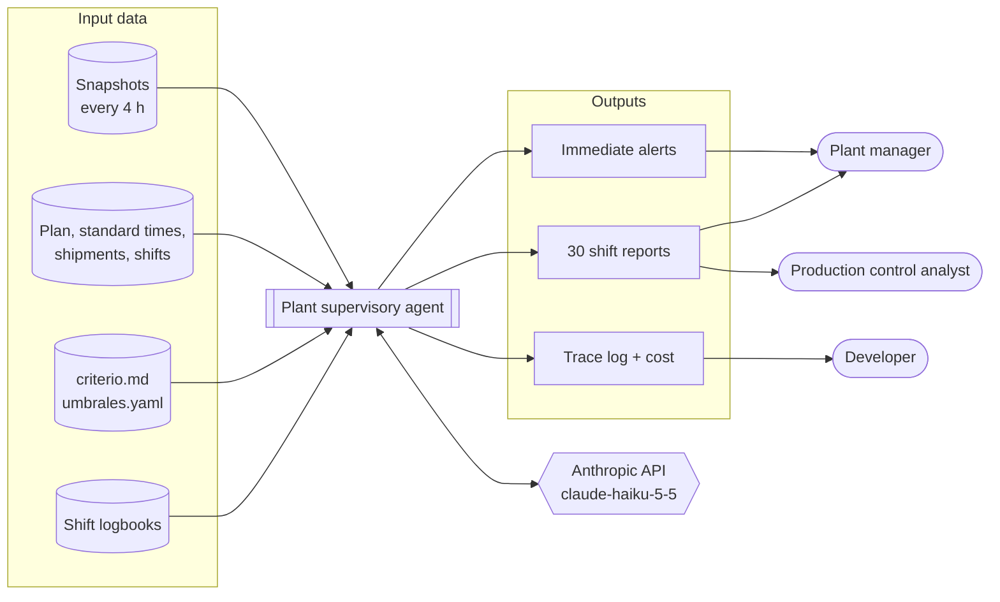

# System context

```mermaid
flowchart LR
    analyst([Production control analyst])
    manager([Plant manager])
    dev([Developer])

    subgraph inputs[Input data]
        snaps[(Snapshots<br/>every 4 h)]
        plant[(Plan, standard times,<br/>shipments, shifts)]
        rules[(criterio.md<br/>umbrales.yaml)]
        logs[(Shift logbooks)]
    end

    system[[Plant supervisory agent]]
    claude{{Anthropic API<br/>claude-haiku-5-5}}

    subgraph outputs[Outputs]
        alerts[Immediate alerts]
        reports[30 shift reports]
        trace[Trace log + cost]
    end

    snaps --> system
    plant --> system
    rules --> system
    logs --> system
    system <--> claude
    system --> alerts --> manager
    system --> reports --> manager
    reports --> analyst
    system --> trace --> dev
```

The system replaces the analyst's manual round. The analyst and the manager consume its notices, and the developer consumes traces, costs and evaluator results.
