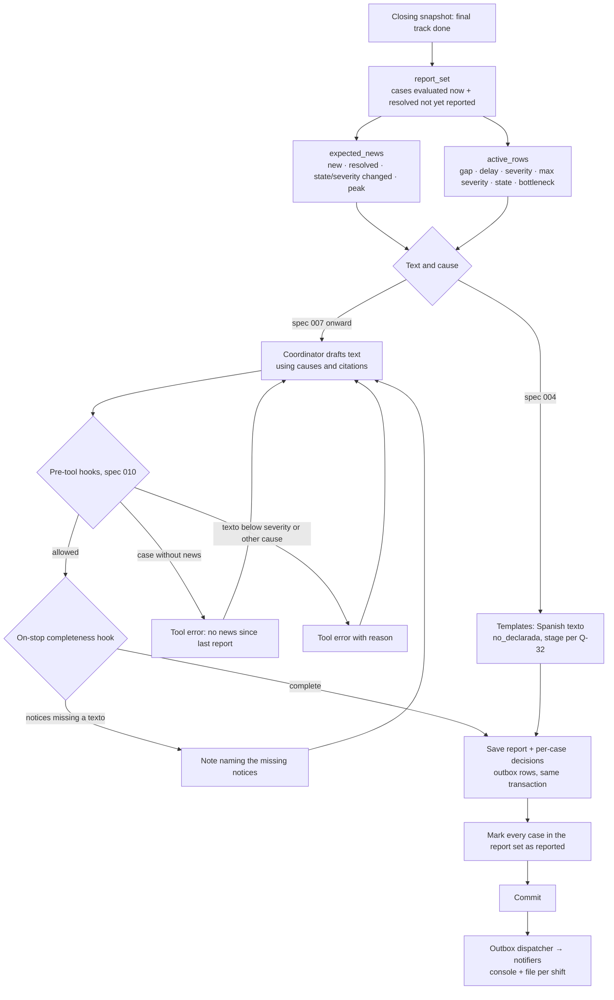

# Shift close

```mermaid
flowchart TD
    close[Closing snapshot: final track done] --> set[report_set<br/>cases evaluated now + resolved not yet reported]
    set --> news[expected_news<br/>new · resolved · state/severity changed · peak]
    set --> active[active_rows<br/>gap · delay · severity · max severity · state · bottleneck]
    news --> text{Text and cause}
    active --> text
    text -- spec 004 --> tmpl[Templates: Spanish texto<br/>no_declarada, stage per Q-32]
    text -- spec 007 onward --> agent[Coordinator drafts text<br/>using causes and citations]
    agent --> pre{Pre-tool hooks, spec 010}
    pre -- case without news --> reject2[Tool error: no news since last report] --> agent
    pre -- texto below severity or other cause --> reject3[Tool error with reason] --> agent
    pre -- allowed --> stop{On-stop completeness hook}
    stop -- notices missing a texto --> reject[Note naming the missing notices] --> agent
    stop -- complete --> save
    tmpl --> save[Save report + per-case decisions<br/>outbox rows, same transaction]
    save --> mark[Mark every case in the report set as reported]
    mark --> commit[Commit]
    commit --> out[Outbox dispatcher → notifiers<br/>console + file per shift]
```

The code decides **which** cases are news and which are active. Until spec 007 it also writes the text. From spec 007 on, the agent decides **how** to say it. The hooks make sure the agent's texts match the code's decision: no text for a case without news, no stated severity below the notice's, no other cause, and no end of turn with a text still missing.

- A case gets one decision per snapshot: `alerta_inmediata`, `informe_de_turno` (news) or `sin_aviso` (unchanged since its last report, §4). A case that escalates at the closing snapshot gets both the alert and its news entry.
- Only cases in the report are marked. A case already reported as resolved is never marked or reported again.
